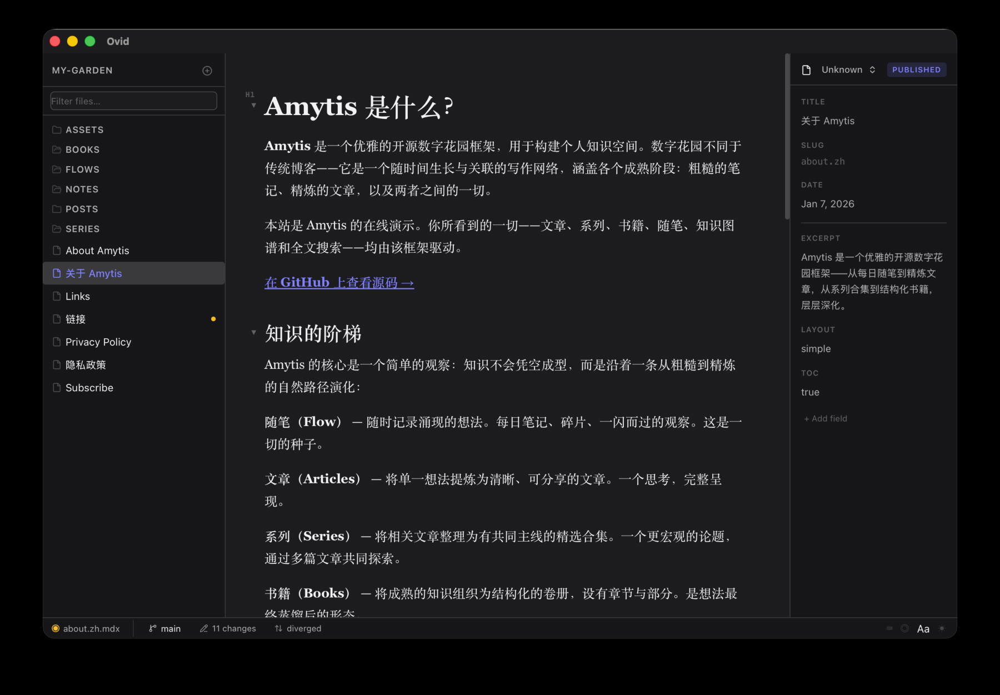

# Ovid

A local-first desktop editor for [Amytis](https://github.com/hutusi/amytis) content workspaces.
It is built for writing-heavy content work: calm editing, keyboard-first navigation, native
workspace access, and Git-aware publishing flows without leaving the workspace.

Built with **Tauri 2 + React + TypeScript + Tailwind CSS v4**, using **Bun** as the package manager.

---

## What Ovid Does

Ovid combines the core workflows needed for Amytis-native writing in one desktop app:

- open an Amytis workspace or a normal Markdown workspace directly from disk
- edit Markdown in a Typora-style rich editor without a split preview
- manage frontmatter and content-type metadata inline
- search files and full workspace text quickly
- handle daily Git actions such as commit, push, pull, fetch, and branch switching

Current release status:

- macOS and Windows packages exist
- macOS public distribution is still limited by the missing Apple signing/notarization work tracked in [issue #43](https://github.com/hutusi/ovid/issues/43)

---

## Screenshot



Ovid editing an Amytis workspace with the file tree, rich Markdown editor, properties panel, and
Git-aware status bar visible in one writing-focused layout.

---

## Requirements

- macOS, Windows, or Linux
- [Bun](https://bun.sh) — package manager and test runner
- [Rust](https://rustup.rs) — required to build the Tauri backend
- `git` on `PATH` — optional; enables git status indicators and commit/push

---

## Installation & Development

```bash
bun install           # Install dependencies
bun run tauri dev     # Start with hot reload
bun run tauri build   # Build distributable app
bun run validate      # Type-check + lint + tests + build + cargo test
```

---

## Release Notes

For release work, use these repo artifacts:

- [CHANGELOG.md](./CHANGELOG.md) for shipped scope
- [docs/release-checklist.md](./docs/release-checklist.md) for release gates and packaging checks
- [docs/updater-release-runbook.md](./docs/updater-release-runbook.md) for updater-compatible release steps

---

## Keyboard Shortcuts

| Shortcut | Action |
|---|---|
| `Cmd+\` | Toggle sidebar |
| `Cmd+Shift+P` | Toggle properties panel |
| `Cmd+Shift+F` | Toggle full-text search |
| `Ctrl+Cmd+Z` | Toggle zen mode |
| `Cmd+Shift+G` | Open commit dialog |
| `Cmd+Shift+O` | Open workspace switcher |
| `Cmd+P` | Open file switcher |
| `Cmd+N` | New file |
| `Cmd+S` | Force save (bypass debounce) |
| `Cmd+W` | Close current file |
| `Cmd+O` | Open workspace (folder picker) |
| `Cmd+K` | Insert / edit link |
| `Cmd+E` | Toggle inline code |
| `F2` | Rename selected file |
| `Esc` | Exit zen mode |

> On Windows/Linux, substitute `Ctrl` for `Cmd`. Zen mode (`Ctrl+Cmd+Z`) is macOS-only.

---

## App Menu

All major actions are accessible from the native menu bar, making features discoverable without knowing keyboard shortcuts.

| Menu | Items |
|---|---|
| **Ovid** | About Ovid, Hide, Quit (standard macOS app menu) |
| **File** | New, Today's Flow, Open Workspace…, Switch Workspace…, Save, Close File |
| **Edit** | Undo, Redo, Cut, Copy, Paste, Select All, Find in Workspace, Open Quickly |
| **Insert** | Link…, Image…, Code Block, Table, Horizontal Rule |
| **Format** | Bold, Italic, Strikethrough, Inline Code, Heading 1-6, Blockquote, Bullet List, Numbered List, Task List |
| **View** | Toggle Sidebar, Toggle Properties Panel, Zen Mode, Typewriter Mode, Toggle Spell Check |
| **Git** | Commit Changes…, Switch Branch…, New Branch…, Open Remote, Copy Remote URL, Push, Pull, Fetch |
| **Window** | Minimize, Zoom (standard macOS window menu) |
| **Help** | Ovid Documentation, Report an Issue… |

Menu items show their keyboard shortcut where one exists. Insert and Format menu items work on the current editor selection.

---

## Git Workflow

Ovid includes built-in Git support for status, commit, push, pull, fetch, branch switching, and multi-remote workflows.

See [Git Workflow](docs/git-workflow.md) for the status-bar model, sync behavior, remote handling, and current Git limits.

---

## Workspaces

### Opening a workspace

Click **Open folder** or press `Cmd+O` to pick a directory. Ovid walks the file tree and detects whether it is an Amytis workspace by checking for `site.config.ts` + `content/` directory. If the folder is not recognised as an Amytis project, a warning toast is shown.

Only `.md` and `.mdx` files appear in the sidebar.

### Auto-reopen

Ovid remembers the last workspace you had open and reopens it automatically on next launch. To suppress this, close the workspace and relaunch — the auto-reopen is skipped once a session starts without a workspace.

### Switching workspaces

Press `Cmd+Shift+O` or click the workspace name in the sidebar header to open the **Workspace Switcher**. It lists your five most recently opened workspaces. Select one to switch, or click **Open folder…** to pick a new directory.

---

## The Sidebar

The sidebar shows the full file tree of the current workspace, filtered to `.md` / `.mdx` files.

- **Toggle** — `Cmd+\` hides/shows the sidebar; state is remembered across sessions
- **Resize** — drag the right border to resize between 180 px and 480 px; width is persisted across sessions
- **Directory expand/collapse** — click a directory to toggle; folder icon changes between open/closed state
- **Filter** — type in the filter input below the header to narrow the file list by filename or frontmatter `title` in real time; press `Esc` or click `✕` to clear
- **Titles** — frontmatter `title` is shown instead of the filename where available
- **Draft indicator** — files with `draft: true` are dimmed
- **Content type icons** — files show an icon based on their frontmatter `type:` field (`post`, `flow`, `series`, `book`, `page`, `note`); a generic file icon is used when the field is absent
- **Git status** — per-file coloured dot appears when the workspace is a git repository (modified, staged, untracked); a rollup dot appears on a collapsed directory if any child has uncommitted changes
- **Context menu** — right-click any file or directory to rename, delete, or create a new file inside that directory
- **Workspace name** — click it to open the workspace switcher

---

## File Management

### New file (`Cmd+N`)

Creates a new `.md` file. You are prompted for a filename. In an Amytis workspace with content types defined, you can also pick a content type — frontmatter fields are pre-filled accordingly. The file opens immediately in the editor.

### Rename (`F2` or double-click filename)

Inline rename in the sidebar. The editor tab updates automatically if the renamed file is currently open. Duplicate names are rejected.

### Make a copy (right-click → Make a Copy)

Creates a sibling copy of the selected post or Markdown file. For folder-backed posts such as `post/index.md` or `post/index.mdx`, Ovid copies the whole post folder and opens the copied index file immediately.

### Delete (right-click → Delete)

Moves the file to the system Trash (not permanent delete). A confirmation dialog is shown. If the file is currently open, it is closed first.

### New folder

Right-click any directory in the sidebar and choose **New file here** to create a file inside it. Subdirectories can be created the same way.

---

## The Editor

Ovid uses a **Typora-style WYSIWYG** editor (Tiptap / ProseMirror). Markdown renders inline as you type — no split pane. Files are persisted as valid Markdown; `.md` and `.mdx` files are both supported and never coerced into a different format.

### Font & size

Click **Aa** in the status bar to open the editor settings popover:

- **Font** — Serif (Georgia), Sans (system-ui), or Mono (Fira Code / JetBrains Mono)
- **Size** — Small (15 px), Default (17 px), Large (19 px)

Preferences are persisted across sessions.

### Spell check

Toggle native OS spell check from the **Aa** popover. The preference is persisted. Misspellings are underlined by the OS without disrupting the editor.

### Zen mode (`Ctrl+Cmd+Z`)

Hides the sidebar, properties panel, and status bar. The editor expands to full width with generous vertical margins. Press `Esc` or `Ctrl+Cmd+Z` again to exit. Works even when the editor has focus.

### Typewriter mode

Toggle from the status bar (⌨ button). Keeps the active line vertically centred as you type, reducing eye movement during long writing sessions.

### Links (`Cmd+K`)

Press `Cmd+K` while the editor has focus to open the link dialog. If the cursor is already inside a link, the dialog pre-fills with the current URL and shows a **Remove** button to unset the link.

### Inline code (`Cmd+E`)

Select text and press `Cmd+E` to wrap it in backticks as inline code. Press again to remove the formatting.

### Code blocks

Fenced code blocks are rendered with syntax highlighting via `lowlight`. Each block has a small toolbar:

- **Language picker** — choose from a curated preset list or enter a custom language label
- **Copy button** — copy the code block contents to the system clipboard with one click

The saved markdown remains a normal fenced code block. If you use a custom language label, Ovid preserves that label on disk even if syntax highlighting falls back to plain/auto highlighting.

### Footnotes

Ovid preserves standard Markdown footnote syntax such as `[^note]` and `[^note]: ...`.

- **References** are visually styled like superscript markers while editing
- **Definitions** are visually offset so footnote blocks are easier to scan

This is an editor-side presentation layer, not a special document model. Footnotes remain plain Markdown text on disk.

### Structural backspace

At the start of structural blocks, `Backspace` removes the current block treatment before it starts merging content into the previous block:

- **Bullet / numbered / task list items** — non-empty items unwrap from the list; empty items also unwrap instead of merging into the previous item
- **Blockquotes** — unwrap one quote level at a time
- **Headings** — convert directly back to a paragraph
- **Code blocks** — empty blocks convert back to a paragraph; non-empty blocks stay intact and do not merge into the previous block

### Image drag-and-drop

Drag one or more image files from Finder (or Explorer) into the editor. Ovid:

1. Copies each image into `<workspace>/assets/` (creating the directory if needed)
2. Inserts a markdown image node at the drop position
3. Shows an inline preview

Supported formats: PNG, JPEG, GIF, WebP, AVIF, SVG.

### Link preview

Hover over any link in the editor to see a URL preview tooltip after a short delay.

---

## Properties Panel

The properties panel sits above the editor and displays the frontmatter of the current file.

- **Toggle** — `Cmd+Shift+P` or click the chevron; state is remembered
- **Content type** — select from the type dropdown (`post`, `flow`, `note`, `series`, `book`, `page`); select **unknown** to remove the `type` field from frontmatter
- **Edit fields** — click any value to edit inline; changes are written back to the frontmatter on disk verbatim
- **Tab between fields** — `Tab` moves to the next field; `Esc` cancels an edit
- **Tags** — type a tag name and press `Enter` or `,` to add; click `×` on a chip to remove
- **Add fields** — type a new key and value into the empty row at the bottom; press `Enter` to confirm
- **Draft badge** — files with `draft: true` show a **Draft** badge; click it to toggle to published (and vice versa)

---

## Navigation

### File switcher (`Cmd+P`)

Fuzzy search across all files in the workspace by filename and frontmatter `title`. Keyboard-navigable. Shows the file path for disambiguation.

### Recent files

The last 10 opened files per workspace are tracked and shown at the top of the file switcher and in the empty state.

### Full-text search (`Cmd+Shift+F`)

Replaces the sidebar with a search panel. The shortcut works even when the editor is focused. Queries run in Rust across the entire workspace. Results show the filename and matching line with context; the match is highlighted. Click any result to open the file. Frontmatter content is included in the search.

---

## Save & Status Bar

The status bar (bottom of the window) shows:

- **Path control** — click the current file path to rename it; folder-backed posts show paths like `hello/index.md`, but only the folder name is editable
- **Save indicator** — grey dot = saved, amber dot = unsaved changes
- **Word count** — total words in the current file
- **Session words** — `+N` words added since the file was opened; resets on file switch
- **Aa** — editor settings (font, size, spell check, session goal)
- **⌨** — typewriter mode toggle
- **◎** — zen mode toggle
- **Theme toggle** — moon/sun icon for dark/light mode

### Force save (`Cmd+S`)

Bypasses the 750 ms debounce and saves immediately.

### Session word count goal

Open the **Aa** popover, enter a target word count, and click **Set**. The status bar shows your progress (`+N/GOAL`). The goal resets when you quit the app.

---

## Amytis Integration

### Workspace validation

On open, Ovid checks for `site.config.ts` + `content/`. If found, it is treated as an Amytis workspace and content type templates are enabled. A warning toast is shown for non-Amytis folders (the app still works normally).

### Content type templates

If `site.config.ts` defines content types (e.g. `post`, `page`, `note`), the **New file** dialog offers a type selector. The chosen type pre-fills the frontmatter fields defined for that type.

### Git status

When the workspace is a git repository, per-file status markers appear in the sidebar (`●` modified, `+` untracked, `S` staged). Status refreshes automatically after each save.

### Commit & push (`Cmd+Shift+G`)

Opens the commit dialog. The commit message is pre-filled as `Update: <title>`, the current branch is shown, and changed files can be included or excluded before confirming. You can optionally enable push in the same dialog. Requires `git` on `PATH`.

### Git menu

Ovid includes a native **Git** menu for the daily actions that make sense inside a writing app:

- **Commit Changes…**
- **Switch Branch…**
- **New Branch…**
- **Push**
- **Pull**
- **Fetch**
- **Open Remote**
- **Copy Remote URL**

### Branch workflows

The current branch appears as a pill in the status bar. Click it to open the branch switcher, which lets you:

- search local branches
- switch branches
- create a new branch
- see upstream / ahead-behind state
- open the current remote
- copy the current remote URL

After a successful branch switch or branch creation, Ovid reloads the workspace so the tree and editor match the checked-out branch.

### Remote awareness

When a branch tracks an upstream, Ovid shows that relationship in the branch UI and in the status-bar branch tooltip. If the branch has a remote but no upstream yet, the UI makes that clear instead of failing silently.

### First push on a new branch

If you push a newly created branch that does not yet have an upstream, Ovid automatically falls back to `git push -u <remote> <branch>`. The branch switcher also exposes this explicitly as **Push + Track** when appropriate.

### Publish flow

In the properties panel, click the **DRAFT** badge to toggle `draft: true/false`. Setting `draft: false` on a file in a git workspace automatically opens the commit dialog pre-filled with `Publish: <title>`.

---

## Dark mode

Follows the system preference by default. Toggle manually with the moon/sun icon in the status bar. The preference is persisted across sessions.

---

## Notifications

Errors and warnings appear as brief toast messages at the bottom centre of the window (visible for 2 seconds). They never block writing.
